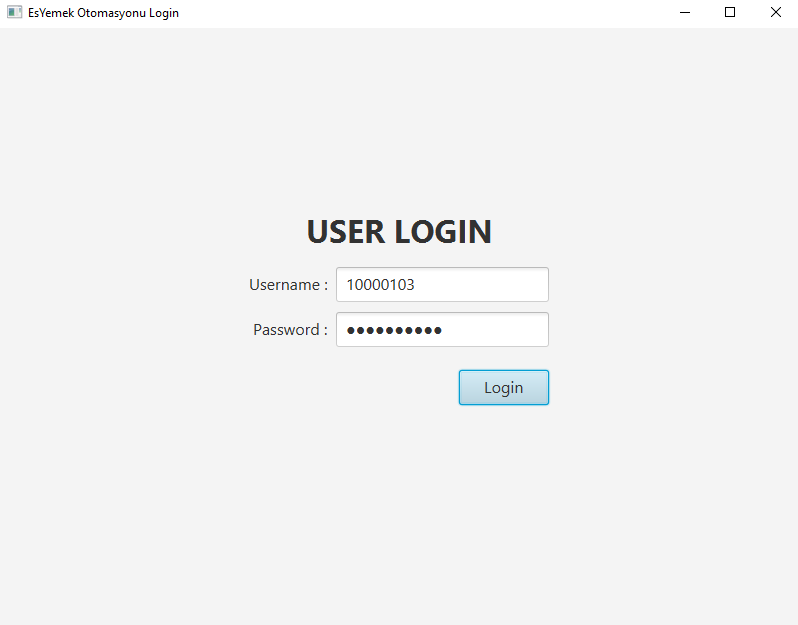
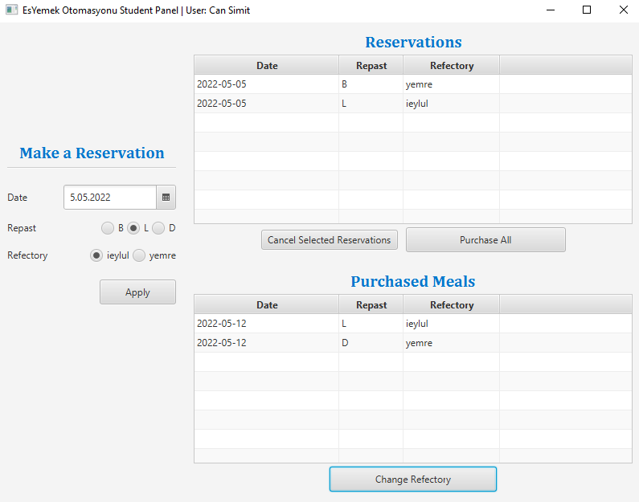
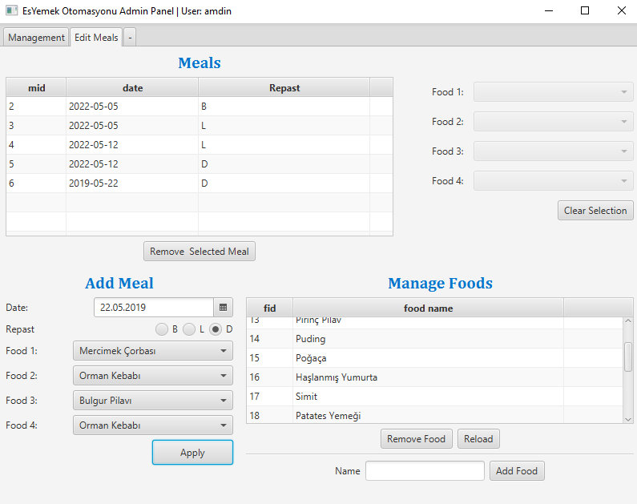
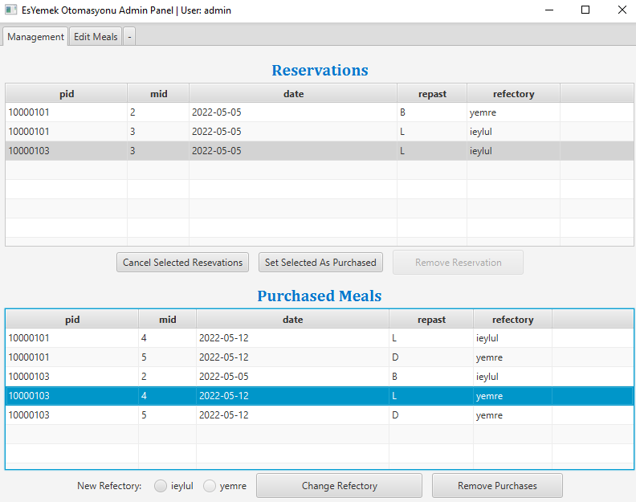

# Refectory Reservation System

Refectory reservation system is a complete <abbr title="Create, Read, Update and Delete">CRUD</abbr> application with graphic user interface for operations.

This was originally a second grade school project on relational database management systems. I've done some changes to make it work on modern Java runtimes and attempted to improve the code quality while I was doing that.  

Originally database connection was done through the client UI directly to the database server. I did not change that aspect but I moved the actual SQL commands out of the UI code and created a separate `service` package to contain the API. Still, there is no actual server so the API is accessed directly from the client, which is *not ideal* to say the least.

Nevertheless, this is my attempt to remaster a project from my early programming years and hopefully make it usable again. I wasn't planning to maintain it after I passed my class but I thought at least I should make it build successfully. It now works provided you have a MySQL server running. There are SQL batch files in the source code to recreate table structure used by the application.

Here are some screenshots of the client UI made with JavaFX:

<i>Login Screen</i>

&nbsp;

&nbsp;

<i>User Panel</i>

&nbsp;

&nbsp;

<i>Admin Panel - Meal Management</i>

&nbsp;

&nbsp;

<i>Admin Panel - Reservation Management</i>

&nbsp;

&nbsp;

